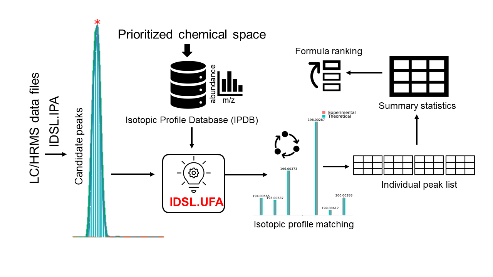

# IDSL.UFA 

<!-- badges: start -->

<!-- badges: end -->

United Formula Annotation (UFA) by the Integrated Data Science Laboratory for Metabolomics and Exposomics (IDSL.ME) is an R pipeline to annotate peaklists from the IDSL.IPA package with molecular formula using an isotopic profile matching approach. The IDSL.UFA pipeline is especially beneficial when MS/MS data is not available.

Visit https://ufa.idsl.me/ for the detailed documentation and tutorial.