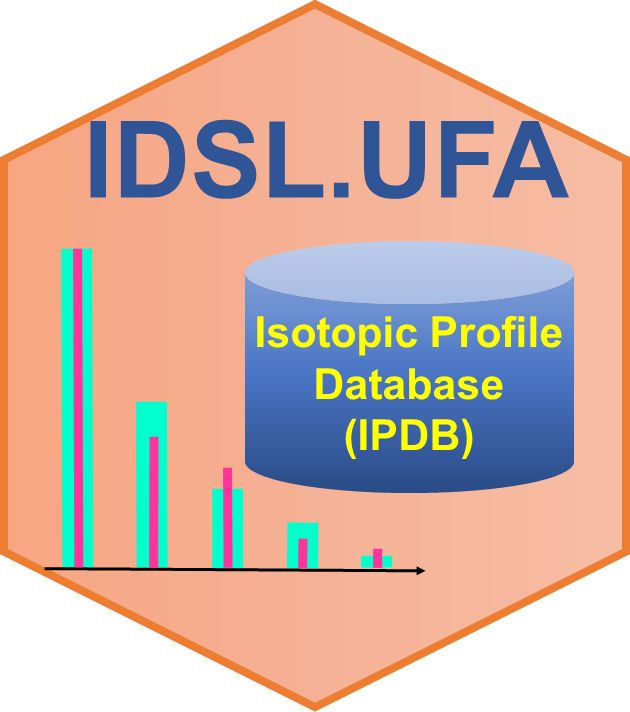
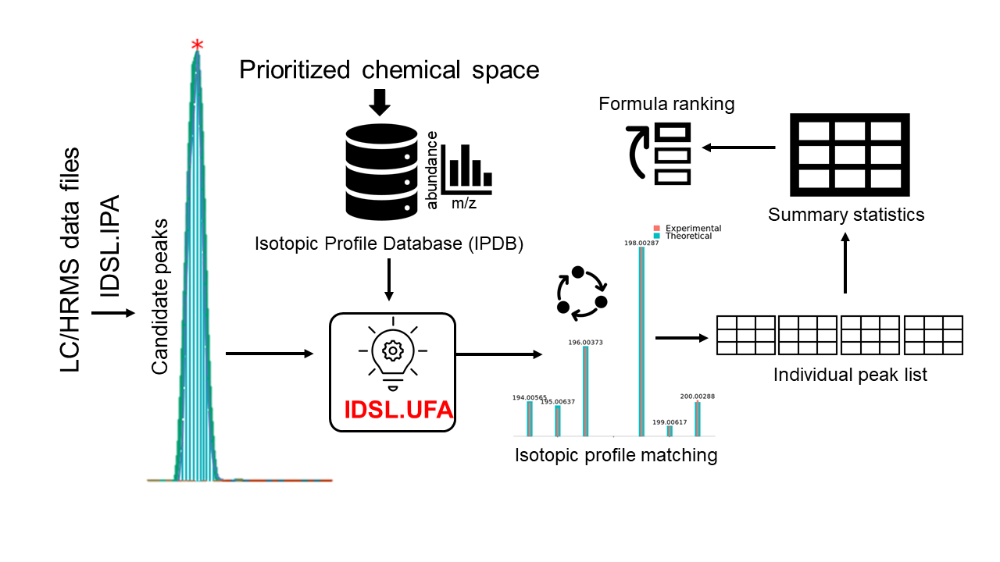

# IDSL.UFA 

<!-- badges: start -->

<!-- badges: end -->

**United Formula Annotation (UFA)** by the [**Integrated Data Science Laboratory for Metabolomics and Exposomics (IDSL.ME)**](https://www.idsl.me/) is a light-weight R package to annotate peaklists from the [**IDSL.IPA**](https://github.com/idslme/IDSL.IPA) package with molecular formula of a prioritized chemical space using an isotopic profile matching approach. The IDSL.UFA pipeline only requires MS1 for formula annotation.

## 

## Table of Contents

- [Background](https://github.com/idslme/IDSL.UFA#background)
- [Features of IDSL.UFA](https://github.com/idslme/IDSL.UFA#features-of-idslufa)
- [Installation](https://github.com/idslme/IDSL.UFA#installation)
- [Workflow](https://github.com/idslme/IDSL.UFA#workflow)
- [Quick Batch Example](https://github.com/idslme/IDSL.UFA#quick-batch-example)
- [Wiki](https://github.com/idslme/IDSL.UFA#wiki)
- [Score Coefficients Optimization](https://github.com/idslme/IDSL.UFA#score-coefficients-optimization)
- [Citation](https://github.com/idslme/IDSL.UFA#citation)

## Background

A chemical compound's molecular formula represents its elemental composition, and is a fundamental property. Assigning molecular formulas to peaks in data generated using untargeted LC/HRMS can help in gaining biological insights from metabolomics and exposomics datasets. It can complement the peak annotation pipelines that need MS2 spectra to assign a structural identity to a peak. Formulas can be assigned using only MS1 spectral data which is available for every sample analyzed using a LC/HRMS instrument in a metabolomics or exposomics study.  

Because of the naturally occuring isotope atoms for each element, MS1 spectral data have more than one mass to charge ratio (m/z) values observed for an ionized species. The isotopic pattern for a chemical structure can be accurately predicted using a set of combinatorial rules that uses atomic mass tables provided by the [International Union of Pure and Applied Chemistry (IUPAC)](https://www.isotopesmatter.com).  To assign a molecular formula, the theoretical isotopic profile of carbon-containing compounds can be queried against the MS1 spectral data using a set of matching criteria and scoring system. Because of the universality of molecular formula assignment, almost all commercial and academic software to process untargeted LC/HRMS datasets have a feature to search a single or list of molecular formulas against the raw MS1 data. Community guidelines for peak annotation also recommend performing the molecular formula assignment step on untargeted LC/HRMS datasets. 

While existing solutions offer a straightforward solution to match theoretical isotopic patterns against the MS1 spectral data, there is still an unmet need to improve the workflow for larger studies and various sources of molecular formula. This is important for exposomics studies where we do expect to see many more compounds from formula sources other than common metabolite databases.

## Features of IDSL.UFA

1) Parameter selection through a well-described [parameter spreadsheet](https://raw.githubusercontent.com/idslme/IDSL.UFA/main/UFA_parameters.xlsx)
2) Generating comprehensive *in-silico* theoretical libraries using natural isotopic distribution profiles
3) Annotating high-throughput and population size studies (n > 500)
4) Aggregating annotated molecular formulas on the aligned peak table. This is a very unique feature that only presented by IDSL.UFA. To familiarize with this statistical mass spectrometry feature, try **PARAM0006** in the `parameters` tab in the [UFA parameter spreadsheet](https://raw.githubusercontent.com/idslme/IDSL.UFA/main/UFA_parameters.xlsx)
5) Generating batch untargeted isotopic profile match figures
6) Compatibility with parallel processing in Windows and Linux environments

## Installation

	install.packages("IDSL.UFA")

## Workflow

To annotate your mass spectrometry data (**mzXML**, **mzML**, **netCDF**), mass spectrometry data should be processed using the [IDSL.IPA](https://github.com/idslme/IDSL.IPA) workflow to acquire chromatographic information of the peaks (***m/z-RT***). When the chromatographic information of individual and aggregated aligned peaklists were generated using the [IDSL.IPA](https://github.com/idslme/IDSL.IPA) workflow, download the [UFA parameter spreadsheet](https://raw.githubusercontent.com/idslme/IDSL.UFA/main/UFA_parameters.xlsx) and select the parameters accordingly and then use this spreadsheet as the input for the IDSL.UFA workflow:

	library(IDSL.UFA)
	UFA_workflow("Address of the UFA parameter spreadsheet")

## Quick Batch Example

Follow these steps for a quick case study (n=33) [ST002263](https://www.metabolomicsworkbench.org/data/DRCCMetadata.php?Mode=Study&StudyID=ST002263&DataMode=AllData&ResultType=1) which has Thermo Q Exactive HF hybrid Orbitrap data collected in the HILIC-ESI-POS/NEG modes. 

1. Process raw mass spectrometry data and chromatographic information using the method described by [IDSL.IPA](https://github.com/idslme/IDSL.IPA#quick-batch-example) 

2. Download these pre-calculated [IPDBs](https://zenodo.org/record/7512923/preview/IPDB_v1.8.zip#tree_item16) and use positive or negative mode IPDB from RefMetDB folder according to the IDSL.IPA folder results. RefMet represents [A **Ref**erence list of **Met**abolite names](https://www.metabolomicsworkbench.org/databases/refmet/).

3. IDSL.UFA requires 30 parameters distributed into 4 separate sections. For this study, use default parameter values presented in the [UFA parameter spreadsheet](https://raw.githubusercontent.com/idslme/IDSL.IPA/main/IPA_parameters.xlsx). Next, Provide address for 
	
	3.1. **PARAM0004** for the *Address of the IPDB (.Rdata)*
	
	3.2. **PARAM0005** and **PARAM0006** should be **YES**
	
	3.3. **PARAM0009** for *HRMS data location address (MS1 level HRMS data)*
	
	3.4. **PARAM0011** for *Address of the `peaklists` directory generated by the IDSL.IPA workflow*
	
	3.5. **PARAM0012** for *Address of the `peak_alignment` directory generated by the IDSL.IPA workflow*
	
	3.6. **PARAM0014** for *Output location address (MS1 processed data)*
	
	3.7. You may also increase the number of processing threads using **PARAM0008** according to your computational power

4. Run this command in R/Rstudio console or terminal: `IDSL.UFA::UFA_workflow("Address of the UFA parameter spreadsheet")`

5. You may parse the results at the address you provided for **PARAM0014**.

## [**Wiki**](https://github.com/idslme/IDSL.UFA/wiki)

1. [**A population size study with 499 indivdual mass spectrometry file**](https://github.com/idslme/IDSL.UFA/wiki/IDSL.UFA-for-MTBLS1684-study)
2. [**List of consistent labeled isotopes**](https://github.com/idslme/IDSL.UFA/wiki/Consistent-Labeled-Isotopes)
3. [**Standard Adduct Type**](https://github.com/idslme/IDSL.UFA/wiki/Standard-Adduct-Type)
4. [**Definitions of Peak Spacing and Intensity Cutoff**](https://github.com/idslme/IDSL.UFA/wiki/Peak-Spacing-and-Intensity-Cutoff)
5. [**Isotopic Profile DataBase (IPDB)**](https://github.com/idslme/IDSL.UFA/wiki/Isotopic-Profile-DataBase-(IPDB))
6. [**PubChem molecular formula database for IDSL.UFA**](https://github.com/idslme/IDSL.UFA/wiki/PubChem-molecular-formula-database-for-IDSL.UFA)
7. [**Definitions of NDCS and RCS**](https://github.com/idslme/IDSL.UFA/wiki/NDCS-RCS)
8. [**Molecular formula class detection**](https://github.com/idslme/IDSL.UFA/wiki/Molecular-formula-class-detection).

## Score Coefficients Optimization

Score coefficients of **1** can be used by default to rank candidate molecular formulas. However, to achieve more desirable formula assignments, identification ranking score coefficients (**PARAM0023**) should be computed using a set of positive weights (see [**section S.1**](https://pubs.acs.org/doi/suppl/10.1021/acs.analchem.2c00563/suppl_file/ac2c00563_si_001.pdf)). To optimize these weights, a set of highest quality annotations from authentic standards should be fed in the IDSL.UFA workflow using the `score_function_optimization` tab in the [UFA parameter spreadsheet](https://raw.githubusercontent.com/idslme/IDSL.UFA/main/UFA_parameters.xlsx). **PARAM0007** in the `parameters` tab should be also selected **YES** to run this tab.

### Note

The IDSL.UFA pipeline originally was developed to annotate IDSL.IPA peaklists that were generated using 12C/13C isotopologue pairs by the IDSL.IPA pipeline. Nevertheless, IDSL.UFA can still annotate IDSL.IPA peaklists with non-carbon ion pairs when the fifth coefficient in the score function in the equation 6 in the main manuscript is zero to neutralize interferences of R13C values. The score coefficients can be adjusted through **PARAM0023** in the [UFA parameter spreadsheet](https://raw.githubusercontent.com/idslme/IDSL.UFA/main/UFA_parameters.xlsx).

## Citation

Fakouri Baygi, S., Banerjee S. K., Chakraborty P., Kumar, Y. Barupal, D.K. [IDSL.UFA assigns high confidence molecular formula annotations for untargeted LC/HRMS datasets in metabolomics and exposomics](https://pubs.acs.org/doi/10.1021/acs.analchem.2c00563). *Analytical Chemistry*, **2022**, *94(39)*, 13315-13322.

Fakouri Baygi, S., Kumar, Y. Barupal, D.K. [IDSL. IPA characterizes the organic chemical space in untargeted LC/HRMS datasets](https://pubs.acs.org/doi/10.1021/acs.jproteome.2c00120). *Journal of proteome research*, **2022**, *21(6)*, 1485-1494.
